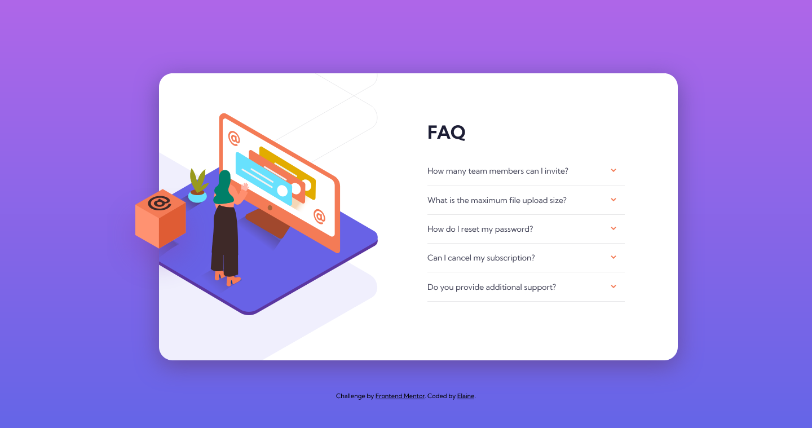

# Frontend Mentor - FAQ accordion card solution

This is a solution to the [FAQ accordion card challenge on Frontend Mentor](https://www.frontendmentor.io/challenges/faq-accordion-card-XlyjD0Oam). Frontend Mentor challenges help you improve your coding skills by building realistic projects. 

## Table of contents

- [Overview](#overview)
  - [The challenge](#the-challenge)
  - [Screenshot](#screenshot)
  - [Links](#links)
- [My process](#my-process)
  - [Built with](#built-with)
  - [What I learned](#what-i-learned)
  - [Continued development](#continued-development)
  - [Useful resources](#useful-resources)
- [Author](#author)
- [Acknowledgments](#acknowledgments)

## Overview

### The challenge

Users should be able to:

- View the optimal layout for the component depending on their device's screen size
- See hover states for all interactive elements on the page
- Hide/Show the answer to a question when the question is clicked

### Screenshot

### Links

- Solution URL: [Link to solution URL](https://www.frontendmentor.io/solutions/responsive-accordion-faq-component-W8IX1jNU_)
- Live Site URL: [Link to live site](https://elaineleung.github.io/frontendmentor/accordioncard/)

## My process

### Built with

- Semantic HTML5 markup
- CSS custom properties
- Flexbox
- CSS Grid
- Mobile-first workflow

### What I learned

In this project I got to experiment a bit more with positioning and responsiveness. Despite all the JS I've done thus far, this is the first time I built an accordion component from scratch, and I resorted to using a code snippet from FreeCodeCamp as reference, which greatly helped to reduce my code. I also tried adding some animation when the accordion items open, which looks quite nice in the end. I decided against adding animation for collapsing the FAQs just to keep things clean.

What I learned is that positioning with SVGs is tricky, and it's best to find the original dimensions before proceeding. I opted to use a wrapper for the SVGs, and I think I must have spent most of my time trying to position the SVGs in the desktop view. 

### Continued development

This component can be used in the near future in one of my projects. I'd also like to see what happens if I don't use wrappers instead for the SVGs, so maybe I'll try that out another time.

### Useful resources

- [How to Build an Accordion Menu Using HTML, CSS and JavaScript](https://www.freecodecamp.org/news/build-an-accordion-menu-using-html-css-and-javascript/) - Here's the reference code snippet from FCC; it's a lot simpler than my original attempt, and I like its use of pseudo elements for the icon.

## Author

- Frontend Mentor - [@elaineleung](https://www.frontendmentor.io/profile/elaineleung)
- Twitter - [@elaineclleung](https://twitter.com/elaineclleung)

## Acknowledgments

Thanks to Kingsley Ubah for his FCC article!