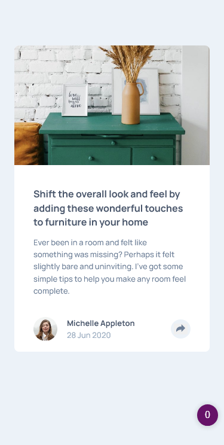
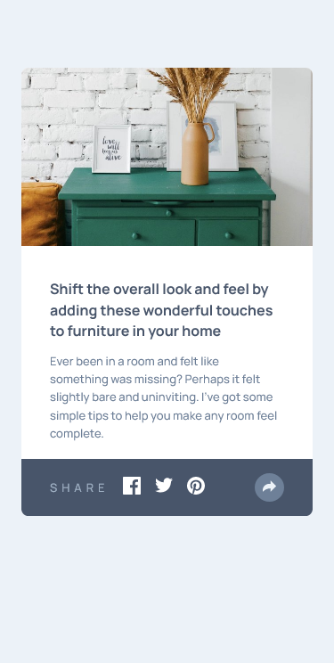
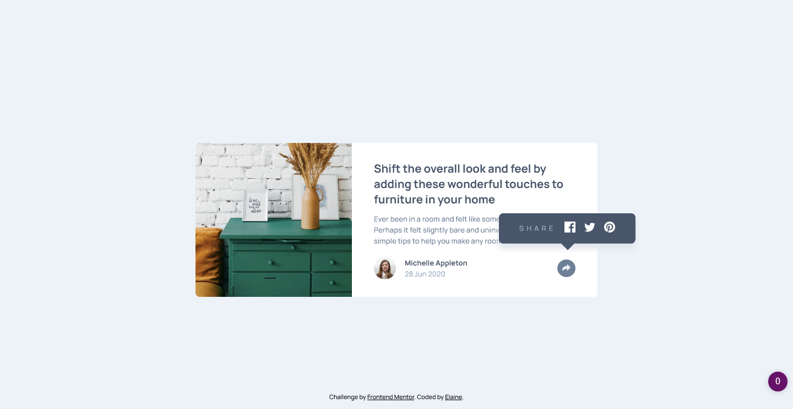

# Frontend Mentor - Article preview component solution

This is a solution to the [Article preview component challenge on Frontend Mentor](https://www.frontendmentor.io/challenges/article-preview-component-dYBN_pYFT). Frontend Mentor challenges help you improve your coding skills by building realistic projects. 

## Table of contents

- [Overview](#overview)
  - [The challenge](#the-challenge)
  - [Screenshot](#screenshot)
  - [Links](#links)
- [My process](#my-process)
  - [Built with](#built-with)
  - [What I learned](#what-i-learned)
  - [Useful resources](#useful-resources)
- [Author](#author)
- [Acknowledgments](#acknowledgments)

**Note: Delete this note and update the table of contents based on what sections you keep.**

## Overview

### The challenge

Users should be able to:

- View the optimal layout for the component depending on their device's screen size
- See the social media share links when they click the share icon

### Screenshot

### Links

- Solution URL: [Link to GitHub repo](https://github.com/elaineleung/frontendmentor/tree/main/articlepreviewcomponent)
- Live Site URL: [Link to live site](https://elaineleung.github.io/frontendmentor/articlepreviewcomponent/)

## My process

### Built with

- Semantic HTML5 markup
- CSS custom properties
- Flexbox
- CSS Grid
- Mobile-first workflow

### What I learned

This was easier than I expected; there weren't major issues I ran into, aside from the need to add or change div containers to the HTML structure while working on the CSS. I did spend some time to experiment with possible configurations in changing the state. I don't usually use composite classes in CSS, but I did that in this case, which made it easier to work with the JS.

I did realize I left out a few things after uploading; I forgot about the box shadow and also, the image had a filter or overlay that I missed. I did try to add this afterwards; wish I had caught it earlier!

### Useful resources

- [Triangle notch on callout](https://codepen.io/moniqueward/pen/yNGQBz) - This codepen helped me with adding the bottom triangle in the popout callout.

## Author

- Frontend Mentor - [@elaineleung](https://www.frontendmentor.io/profile/elaineleung)
- Twitter - [@elaineclleung](https://twitter.com/elaineclleung)

## Acknowledgments

Thanks to Monique for her Codepen!
