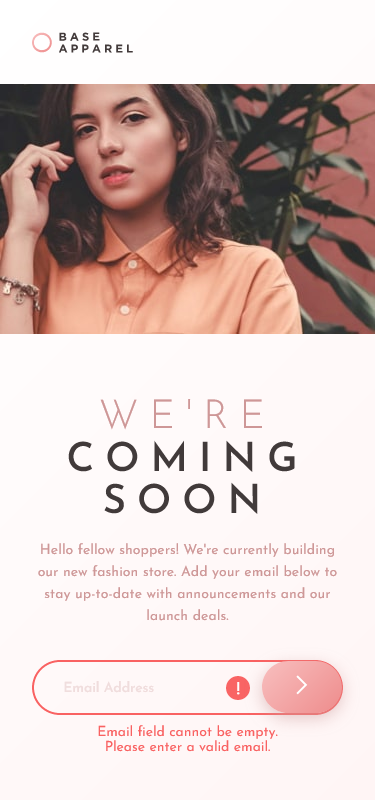
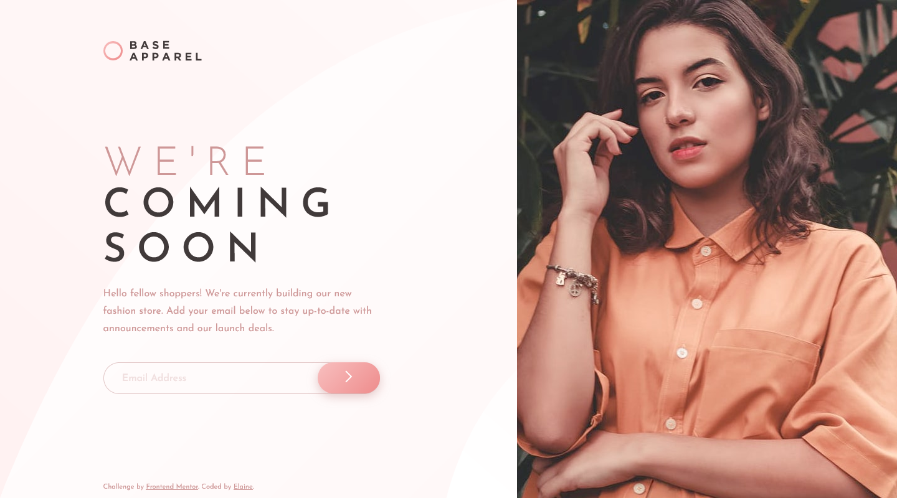

# Frontend Mentor - Base Apparel coming soon page solution

This is a solution to the [Base Apparel coming soon page challenge on Frontend Mentor](https://www.frontendmentor.io/challenges/base-apparel-coming-soon-page-5d46b47f8db8a7063f9331a0). Frontend Mentor challenges help you improve your coding skills by building realistic projects. 

## Table of contents

- [Overview](#overview)
  - [The challenge](#the-challenge)
  - [Screenshot](#screenshot)
  - [Links](#links)
- [My process](#my-process)
  - [Built with](#built-with)
  - [What I learned](#what-i-learned)
  - [Continued development](#continued-development)
  - [Useful resources](#useful-resources)
- [Author](#author)

## Overview

### The challenge

Users should be able to:

- View the optimal layout for the site depending on their device's screen size
- See hover states for all interactive elements on the page
- Receive an error message when the `form` is submitted if:
  - The `input` field is empty
  - The email address is not formatted correctly

### Screenshot

### Links

- Solution URL: [Link to solution URL](https://www.frontendmentor.io/solutions/responsive-landing-page-using-flexbox-and-css-grid-to0RksRRE)
- Live Site URL: [Link to live site](https://elaineleung.github.io/frontendmentor/baseapparelcomingsoon/)

## My process

### Built with

- Semantic HTML5 markup
- CSS custom properties
- Flexbox
- CSS Grid
- Mobile-first workflow

### What I learned

With this challenge I learned how to use email validation and how to use custom styling. I still can't really write my own RegEx, but at least there's a bunch of expressions out there available.

One of the things I had to spend some time on was again those background SVGs that seem to trip me up every time. Anyway, seems like I'm getting better at them but I still can't say I love working with them!

### Continued development

This is a great design for a coming soon landing page, and I can see myself using this for a project soon.

### Useful resources

- [Ideas on custom styles for validation](https://webdesign.tutsplus.com/tutorials/html5-form-validation-with-the-pattern-attribute--cms-25145) - I started with this article, which gave me some ideas on how to work out the validation styling.
- [Email validation RegEx](https://www.w3resource.com/javascript/form/email-validation.php) - This is just one of the resources I looked at regarding email validation.
- [CSS grid](https://css-tricks.com/snippets/css/complete-guide-grid/) - Had to check my go-to CSS grid resource for one of my divs; I don't use grid as much as I use flexbox, but I definitely love how versatile it is. Just need to get more practice using it!

## Author

- Frontend Mentor - [@elaineleung](https://www.frontendmentor.io/profile/elaineleung)
- Twitter - [@elaineclleung](https://twitter.com/elaineclleung)

