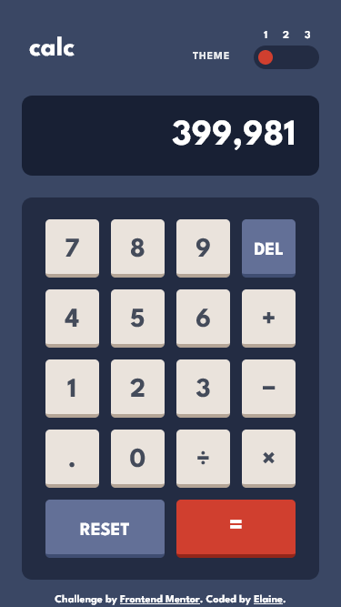
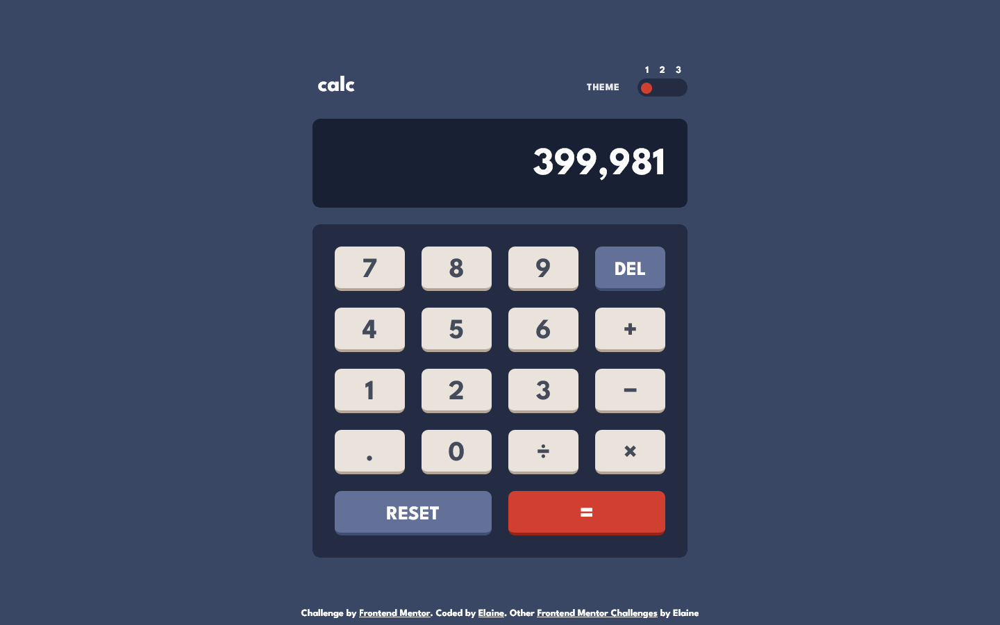

# Frontend Mentor - Calculator app solution

This is a solution to the [Calculator app challenge on Frontend Mentor](https://www.frontendmentor.io/challenges/calculator-app-9lteq5N29). Frontend Mentor challenges help you improve your coding skills by building realistic projects. 

## Table of contents

- [Overview](#overview)
  - [The challenge](#the-challenge)
  - [Screenshot](#screenshot)
  - [Links](#links)
- [My process](#my-process)
  - [Built with](#built-with)
  - [What I learned](#what-i-learned)
  - [Continued development](#continued-development)
  - [Useful resources](#useful-resources)
- [Author](#author)
- [Acknowledgments](#acknowledgments)

## Overview

### The challenge

Users should be able to:

- See the size of the elements adjust based on their device's screen size
- Perform mathmatical operations like addition, subtraction, multiplication, and division
- Adjust the color theme based on their preference
- **Bonus**: Have their initial theme preference checked using `prefers-color-scheme` and have any additional changes saved in the browser

### Screenshot

### Links

- Solution URL: [Add solution URL here](https://your-solution-url.com)
- Live Site URL: [Link to live site](https://elaineleung.github.io/frontendmentor/calculatorapp/)

## My process

### Built with

- Semantic HTML5 markup
- CSS custom properties
- Flexbox
- CSS Grid
- Mobile-first workflow
- Vanilla JS

### What I learned

This is my first intermediate challenge; I had wanted to finish all the Junior ones first, but since I've been seeing a lot of solutions of this challenge, I wanted to dig up my old calculator app and see whether I can reuse parts of it for the challenge. My old app was already fairly functional; I just needed to write a bit more to handle the decimal, but honestly it was a lot of spaghetti code, too many switches and if/else statements. Instead of trying to refactor and clean up my old code, I decided to start over and looked around for tutorials to see people built their calculators. Almost all the ones I found were somewhat similar to mine, in that there were a lot of things pieced together, a lot of edge cases that were handled along the way that made the code hard to read as a whole. Bascially there was just a lot of complexity, and I wanted to find something that can handle the complexity in a simple way.

The one calculator I found that matched what I was looking is the one by Kyle from Web Dev Simplified (link below). It was the only one that used a JS class object, and it turns that it was the cleanest one as well in terms of code and functionality. Most importantly, it addressed the issue I had with my old calculator in handling the decimal, and it also gave me the chance to practice writing classes, which is something I've only done in React (back when state was written in classes). I watched his tutorial at least twice to make sure I understand the core concepts, and then I built it out myself, with the occasional sneak peak at his repo. I also added other functionality that wasn't in his tutorial, and overall I think that worked well. I modeled the calculator largely on the one in Windows, and that helped a lot as well.

I also managed to reuse the switch I had from the previous challenge that I used for building the theme switcher in this challenge. This is actually the first time I built a robust theme switcher for anything, and it was thanks to @azhar1038's solution that led me to Adam Argyle's tutorial on building a color theme switcher.

### Continued development

Features I want to add:

- Usage with the tab key: I already wrote the HTML in a way that would allow me to add this later on 

- A display for the previous operand: This was in many of the calculators I saw (including Kyle's), and while it wasn't included in this one, I still wanted to see whether I can add this later.

### Useful resources

- [Building a theme switch component](https://web.dev/building-a-theme-switch-component/) - This helped me in building the JS and CSS for a color theme switcher.

- [On Designing and Building Toggle Switches](https://www.sarasoueidan.com/blog/toggle-switch-design/) - Sara's post gave me the blueprint for building my own switch here.

- [Build A Calculator With JavaScript Tutorial](https://www.youtube.com/watch?v=j59qQ7YWLxw) - Web Dev Simlified's calculator tutorial, which gave me the blueprint for building my own

## Author

- Frontend Mentor - [@elaineleung](https://www.frontendmentor.io/profile/elaineleung)
- Twitter - [@elaineclleung](https://twitter.com/elaineclleung)

## Acknowledgments

Great thanks to Kyle Cook from Web Dev Simplified!

