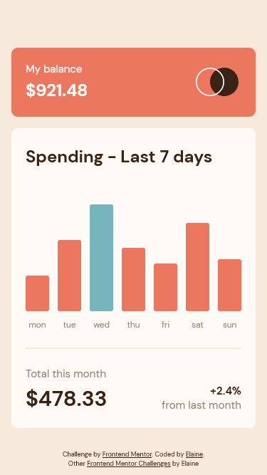
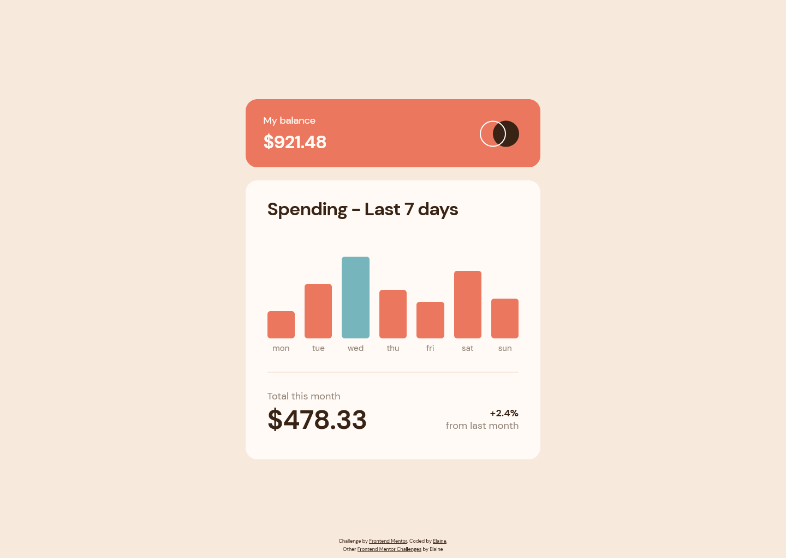

# Frontend Mentor - Expenses chart component solution

This is a solution to the [Expenses chart component challenge on Frontend Mentor](https://www.frontendmentor.io/challenges/expenses-chart-component-e7yJBUdjwt). Frontend Mentor challenges help you improve your coding skills by building realistic projects. 

## Table of contents

- [Overview](#overview)
  - [The challenge](#the-challenge)
  - [Screenshot](#screenshot)
  - [Links](#links)
- [My process](#my-process)
  - [Built with](#built-with)
  - [What I learned](#what-i-learned)
  - [Continued development](#continued-development)
  - [Useful resources](#useful-resources)
- [Author](#author)
- [Acknowledgments](#acknowledgments)

## Overview

### The challenge

Users should be able to:

- View the bar chart and hover over the individual bars to see the correct amounts for each day
- See the current day’s bar highlighted in a different colour to the other bars
- View the optimal layout for the content depending on their device’s screen size
- See hover states for all interactive elements on the page
- **Bonus**: Use the JSON data file provided to dynamically size the bars on the chart

### Screenshot

### Links

- Solution URL: [Link to GitHub repo](https://github.com/elaineleung/frontendmentor/tree/main/expenseschartcomponent/)
- Live Site URL: [Link to live site](https://elaineleung.github.io/frontendmentor/expenseschartcomponent/)

## My process

### Built with

- Semantic HTML5 markup
- CSS custom properties
- Flexbox
- Mobile-first workflow
- SCSS
- BEM
- JSON

### What I learned

This is the first junior level project I worked on; the biggest difference I find between a junior project and a newbie one is the proficiency that is requried in Javascript. The JSON part wasn't that difficult since I actually use JSON on my own FM Github main site. Perhaps the biggest challenge I found wasn't with the coding but in naming the classes in SCSS because I found myself nesting too many levels and eventually needed to figure out how to write everything in a way that's still succinct but readable. Overall, this was a fun weekend project, and I was proud of how bar graph turned.

### Continued development

Not sure how I'd use this in other projects, but I think one thing that can be worked on in my spare time is how to animate the bar charts to have them start from zero.

### Useful resources

- [clamp()](https://developer.mozilla.org/en-US/docs/Web/CSS/clamp) - This might have been the first time I really looked into how to use clamp as I felt I wanted to see whether I could change the margins of the hovered amount div. 

## Author

- Frontend Mentor - [@elaineleung](https://www.frontendmentor.io/profile/elaineleung)
- Twitter - [@elaineclleung](https://twitter.com/elaineclleung)

## Acknowledgments

I'd like to thank myself for getting into Scrimba's weeklong challenges a month ago because not only did I throw myself back into programming after a long absence, I also made a few things that I managed to use as a reference here (such as the hovering info boxes).
