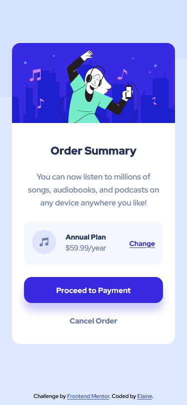
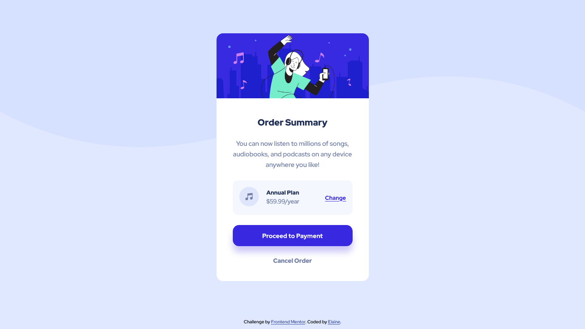

# Frontend Mentor: Order summary card solution

This is a solution to the [Order summary card challenge on Frontend Mentor](https://www.frontendmentor.io/challenges/order-summary-component-QlPmajDUj). Frontend Mentor challenges help you improve your coding skills by building realistic projects.

## Table of contents

- [Overview](#overview)
  - [The challenge](#the-challenge)
  - [Screenshot](#screenshot)
  - [Links](#links)
- [My process](#my-process)
  - [Built with](#built-with)
  - [What I learned](#what-i-learned)
  - [Continued development](#continued-development)
  - [Useful resources](#useful-resources)
- [Author](#author)
- [Acknowledgments](#acknowledgments)

## Overview

This is an order summary card component, which is soemthing users usually encounter when making a transaction such as purchasing a product or renewing their subscription.

### The challenge

Users should be able to:

- See hover states for interactive elements

### Screenshot

### Links

- Solution URL: [Link to Github repo](https://github.com/elaineleung/frontendmentor/tree/main/ordersummary)
- Live Site URL: [Link to live site](https://elaineleung.github.io/frontendmentor/ordersummary/)

## My process

### Built with

- Semantic HTML5 markup
- CSS custom properties
- Flexbox
- CSS Grid
- Mobile-first workflow

### What I learned

I'm fairly familiar with using flexbox and grid already; perhaps the one thing I didn't know prior to building this is that `justify-self` cannot be used in flexbox when `justify-items` is being used, which makes sense.

Even though I've done similar assignments before where I need to take a brief with a style sheet and build out a product, this is maybe the first time in a long while I've done it, and it took some time because I'm usually building my own projects instead of others', and it requires more attention to detail (I almost missed the box shadow under the button).

Since this is the first FM project, I decided to create this within a repo instead of having this as its own repo. I suppose having this as a standalone repo is also an option, but it's nicer to have a repo with all the FM projects in one place. It's also my first time using GitHub pages, which is what I decided on instead of the usual routes of Vercel or Netlify

### Continued development

This could be a good template for times when I'd need to build a page where products or services are being sold.

### Useful resources

- [Box shadow](https://css-tricks.com/almanac/properties/b/box-shadow/)
- [Red Hat Display font](https://fonts.google.com/specimen/Red+Hat+Display)

## Author

- Frontend Mentor - [@elaineleung](https://www.frontendmentor.io/profile/elaineleung)
- Twitter - [@elaineclleung](https://twitter.com/elaineclleung)

## Acknowledgments

Thank you to CSS-Tricks, which is helpful as always!
