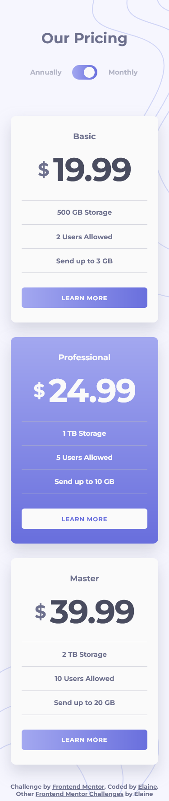
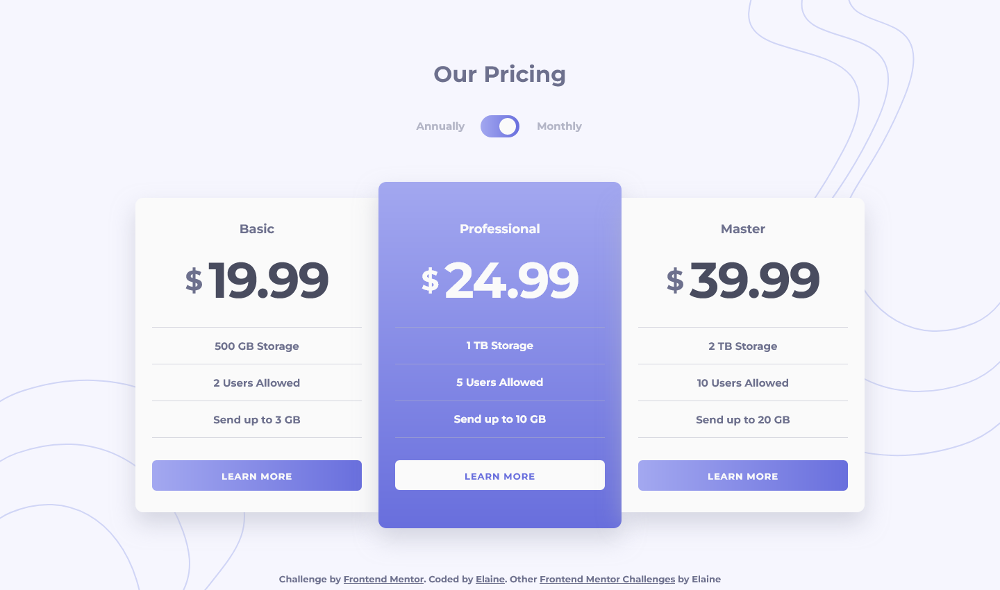

# Frontend Mentor - Pricing component with toggle solution

This is a solution to the [Pricing component with toggle challenge on Frontend Mentor](https://www.frontendmentor.io/challenges/pricing-component-with-toggle-8vPwRMIC). Frontend Mentor challenges help you improve your coding skills by building realistic projects. 

## Table of contents

- [Overview](#overview)
  - [The challenge](#the-challenge)
  - [Screenshot](#screenshot)
  - [Links](#links)
- [My process](#my-process)
  - [Built with](#built-with)
  - [What I learned](#what-i-learned)
  - [Continued development](#continued-development)
  - [Useful resources](#useful-resources)
- [Author](#author)
- [Acknowledgments](#acknowledgments)

## Overview

### The challenge

Users should be able to:

- View the optimal layout for the component depending on their device's screen size
- Control the toggle with both their mouse/trackpad and their keyboard
- **Bonus**: Complete the challenge with just HTML and CSS

### Screenshot

### Links

- Solution URL: [Link to solution URL](https://www.frontendmentor.io/solutions/responsive-toggle-component-with-only-css-and-html-QvlVxD2YK3)
- Live Site URL: [Link to live site](https://elaineleung.github.io/frontendmentor/pricingcomponentwithtoggle/)

## My process

### Built with

- Semantic HTML5 markup
- CSS custom properties
- Flexbox
- CSS Grid
- Mobile-first workflow

### What I learned

The main thing I learned was how to build an accessible toggle switch, thanks to Sara Soueidan's post on toggle switch design. I also took the slider component from the last challenge I did and used it to create a transition effect here. 

I decided to take on the challenge of writing all the functionality without Javascript. While I appreciate being able to use just CSS here, a lot of things could have been easily done with Javascript. The challenging part here is that, in order to have the radio inputs affect the other elements, I can't have the inputs nested without other divs, and so I had to modify Sara's toggle and made it so that the radio inputs are siblings with the plan cards, which are the elements I needed to change. Because I can't have the inputs nested, I had to actually use `position: absolute` to position a number of the elements of the switch. I'm usually against doing this sort of thing, but I didn't have a choice here if I wanted to just rely on CSS. The good thing is at least I learned what I could do in the event I can't use Javascript.

Another thing I did here is to continue trying out CUBE CSS. After watching Kevin Powell work on his FEM challenge, I wanted to try some of the things he did, and I felt a bit more confident using utility classes this time around.

### Continued development

I'd want to see how to build a light switch toggle again but with JS used for functionality, maybe in a dark/light mode situation.

### Useful resources

- [On Designing and Building Toggle Switches](https://www.sarasoueidan.com/blog/toggle-switch-design/) - Sara's post gave me the blueprint for building my own switch here.
- [Kevin Powell's tutorial on building an FEM challenge](https://youtube.com/playlist?list=PL4-IK0AVhVjNDRHoXGort7sDWcna8cGPA) - This helped me in so many ways, from learning how to use CUBE to seeing his method in writing out his code. I'll probably keep this link up here since I think this is one of my key resources.

## Author

- Frontend Mentor - [@elaineleung](https://www.frontendmentor.io/profile/elaineleung)
- Twitter - [@elaineclleung](https://twitter.com/elaineclleung)

## Acknowledgments

Huge thanks to Sara Soueidan for all her work and writing on accessibility!