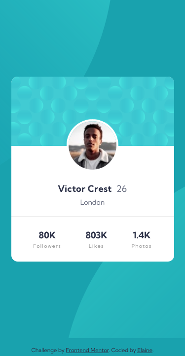

# Frontend Mentor - Profile card component solution

This is a solution to the [Profile card component challenge on Frontend Mentor](https://www.frontendmentor.io/challenges/profile-card-component-cfArpWshJ). Frontend Mentor challenges help you improve your coding skills by building realistic projects.

## Table of contents

- [Overview](#overview)
  - [The challenge](#the-challenge)
  - [Screenshot](#screenshot)
  - [Links](#links)
- [My process](#my-process)
  - [Built with](#built-with)
  - [What I learned](#what-i-learned)
  - [Continued development](#continued-development)
- [Author](#author)
- [Acknowledgments](#acknowledgments)

## Overview

### The challenge

- Build out the project to the designs provided

### Screenshot

### Links

- Solution URL: [Link to GitHub repo](https://github.com/elaineleung/frontendmentor/tree/main/profilecard)
- Live Site URL: [Link to live site](https://elaineleung.github.io/frontendmentor/profilecard/)

## My process

### Built with

- Semantic HTML5 markup
- CSS custom properties
- Flexbox
- CSS Grid
- Mobile-first workflow

### What I learned

This challenge appears very simple at first glance; its complexity lies in whether or not you know how to use positioning in CSS. After completing the challenge, I was reminded of the time when I watched climbers competing at bouldering, where the holds on the route seemed so simple, and yet only a few could reach the top. In any case, it turns out all the learnings I had (or fumbling around) in trying to use the position attribute in my other projects paid off here. I experimented a lot with how to position the circles, and ultimately decided on using pseudo classes along with `position:absolute`. Similar to bouldering, the key takeaway is to determine where the element should be anchored to in relation to its position.

### Continued development

This can be helpful when I need to use shapes in my design, which I've been somewhat hesitant to do, mainly because I don't know where to put them spatially in terms of design.

## Author

- Frontend Mentor - [@elaineleung](https://www.frontendmentor.io/profile/elaineleung)
- Twitter - [@elaineclleung](https://twitter.com/elaineclleung)

## Acknowledgments

Thank you to Gary Simon and Kevin Powell for their videos and tutorials on using pseudo elements and `position:absolute`!
