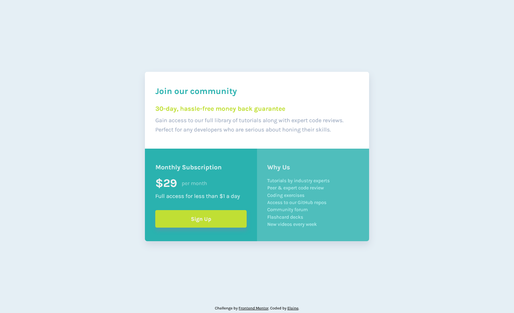

# Frontend Mentor - Single price grid component solution

This is a solution to the [Single price grid component challenge on Frontend Mentor](https://www.frontendmentor.io/challenges/single-price-grid-component-5ce41129d0ff452fec5abbbc). Frontend Mentor challenges help you improve your coding skills by building realistic projects.

## Table of contents

- [Overview](#overview)
  - [The challenge](#the-challenge)
  - [Screenshot](#screenshot)
  - [Links](#links)
- [My process](#my-process)
  - [Built with](#built-with)
  - [What I learned](#what-i-learned)
- [Author](#author)

## Overview

### The challenge

Users should be able to:

- View the optimal layout for the component depending on their device's screen size
- See a hover state on desktop for the Sign Up call-to-action

### Screenshot

### Links

- Solution URL: [Link to solution URL](https://www.frontendmentor.io/solutions/mobile-first-single-price-grid-component-0cfs1sTWs)
- Live Site URL: [Link to live site](https://elaineleung.github.io/frontendmentor/singlepricegrid/)

## My process

### Built with

- Semantic HTML5 markup
- CSS custom properties
- Flexbox
- CSS Grid
- Mobile-first workflow

### What I learned

In this challenge I mainly learned what *not* to do, as in, do not have 5 different shades of white for your font unless you want to spend all that time customizing.

I'm also pretty much convinced at this point that some of these color choices probably won't pass the AA color contrast accessibility requriement.

## Author

- Frontend Mentor - [@elaineleung](https://www.frontendmentor.io/profile/elaineleung)
- Twitter - [@elaineclleung](https://twitter.com/elaineclleung)
