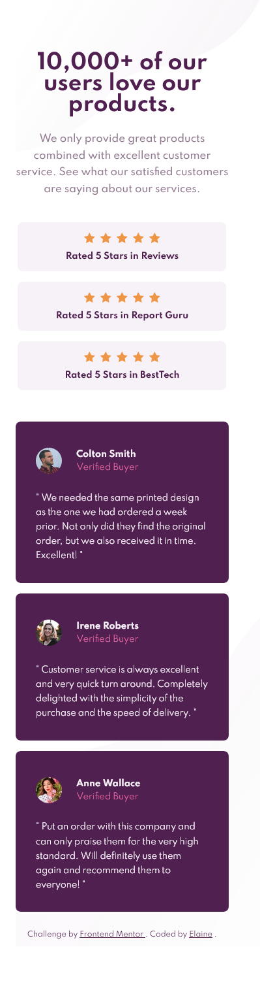
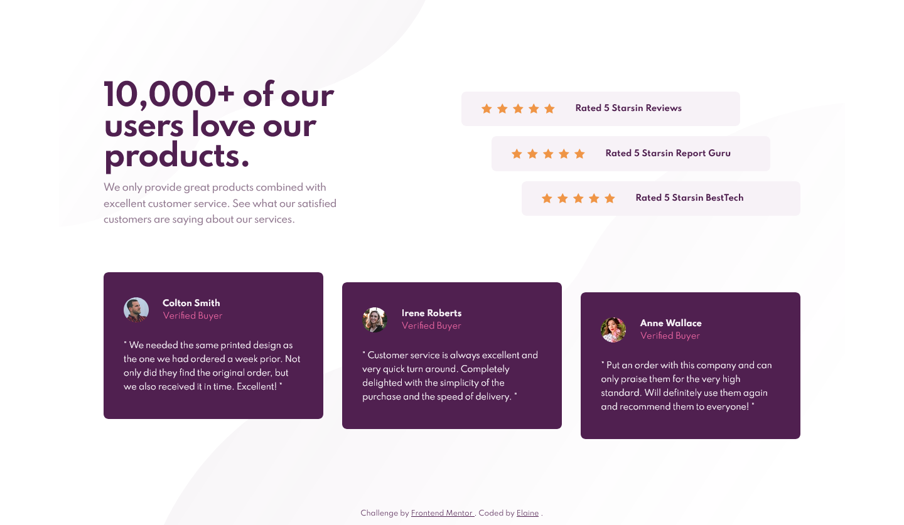

# Frontend Mentor - Social proof section solution

This is a solution to the [Social proof section challenge on Frontend Mentor](https://www.frontendmentor.io/challenges/social-proof-section-6e0qTv_bA). Frontend Mentor challenges help you improve your coding skills by building realistic projects.

## Table of contents

- [Overview](#overview)
  - [The challenge](#the-challenge)
  - [Screenshot](#screenshot)
  - [Links](#links)
- [My process](#my-process)
  - [Built with](#built-with)
  - [What I learned](#what-i-learned)
- [Author](#author)

## Overview

### The challenge

Users should be able to:

- View the optimal layout for the section depending on their device's screen size

### Screenshot

### Links

- Solution URL: [Link to solution URL](https://www.frontendmentor.io/solutions/mobilefirst-social-proof-section-9YtPL58Ph)
- Live Site URL: [Link to live site](https://elaineleung.github.io/frontendmentor/socialproofsection/)

## My process

### Built with

- Semantic HTML5 markup
- CSS custom properties
- Flexbox
- CSS Grid
- Mobile-first workflow

### What I learned

What I learned is that I can't always rely on what I see in the desktop and mobile views; I always need to check the files first to see what all the pieces are because I almost missed those decorative shapes again. I'm not sure why they are designed this way, in that the background is almost invisible, and if I were colorblind or had any vision issues, I would have missed them entirely.

I also learned that this kind of a component is called a social proof, which I've always called a testimonial.

## Author

- Frontend Mentor - [@elaineleung](https://www.frontendmentor.io/profile/elaineleung)
- Twitter - [@elaineclleung](https://twitter.com/elaineclleung)
