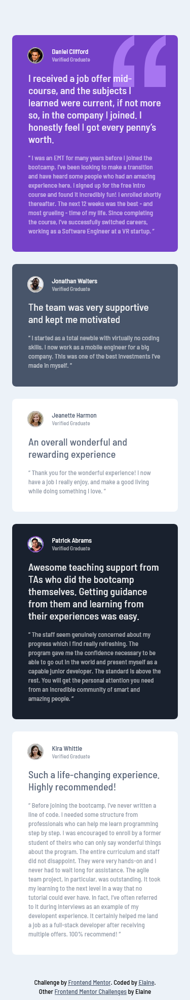

# Frontend Mentor - Testimonials grid section solution

This is a solution to the [Testimonials grid section challenge on Frontend Mentor](https://www.frontendmentor.io/challenges/testimonials-grid-section-Nnw6J7Un7). Frontend Mentor challenges help you improve your coding skills by building realistic projects. 

## Table of contents

- [Overview](#overview)
  - [The challenge](#the-challenge)
  - [Screenshot](#screenshot)
  - [Links](#links)
- [My process](#my-process)
  - [Built with](#built-with)
  - [What I learned](#what-i-learned)
  - [Useful resources](#useful-resources)
- [Author](#author)
- [Acknowledgments](#acknowledgments)

## Overview

### The challenge

Users should be able to:

- View the optimal layout for the site depending on their device's screen size

### Screenshot

### Links

- Solution URL: [Link to GitHub repo](https://github.com/elaineleung/frontendmentor/tree/main/testimonialsgridsection/)
- Live Site URL: [Link to live site](https://elaineleung.github.io/frontendmentor/testimonialsgridsection/)

## My process

### Built with

- Semantic HTML5 markup
- CSS custom properties
- Flexbox
- CSS Grid
- Mobile-first workflow
- CUBE CSS

### What I learned

This was a fairly quick and easy challenge, mainly because I've worked with CSS Grid before; this challenge was a lot easier than I thought, and the only thing I really needed to look up was how to set the grid column width in a grid template area and also the text colors for the component. I ended up checking Kevin's repo for that.

Overall, this was a nice challenge for practicing more CUBE CSS.

### Useful resources

- [Kevin Powell's repo on learning grid](https://github.com/kevin-powell/learn-grid-the-easy-way) - I actually used this more for finding colors than for grid
- [Learn CSS Grid the easy way](https://youtu.be/rg7Fvvl3taU) - This was where I found out how to set up the widths in a template; it turns out that I was just using the wrong values.

## Author

- Frontend Mentor - [@elaineleung](https://www.frontendmentor.io/profile/elaineleung)
- Twitter - [@elaineclleung](https://twitter.com/elaineclleung)

## Acknowledgments

Much thanks to Kevin Powell, as always!