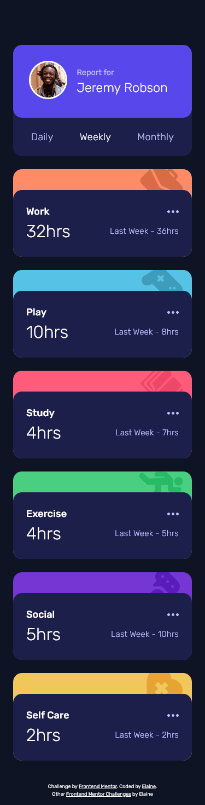
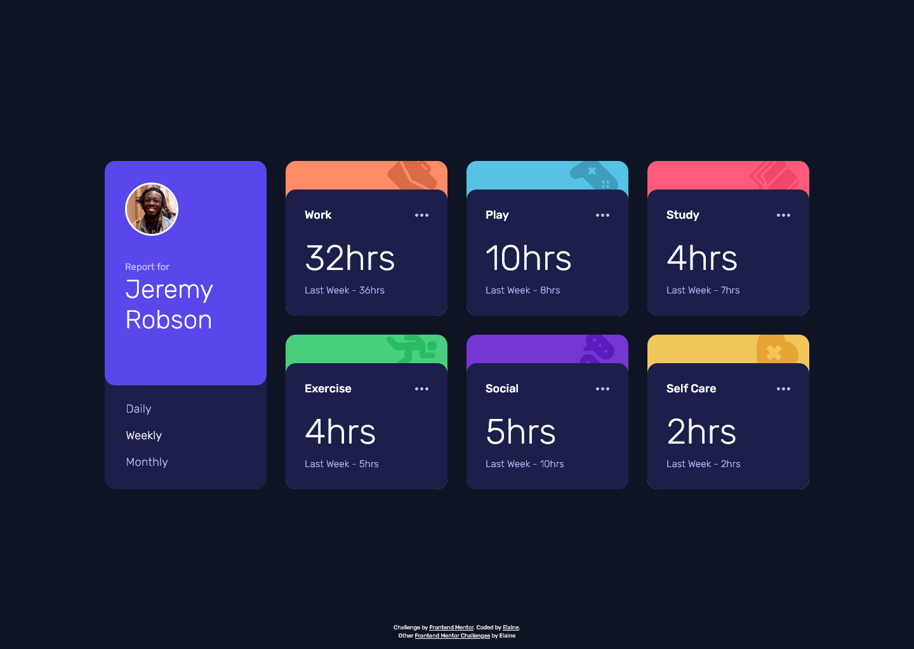

# Frontend Mentor - Time tracking dashboard solution

This is a solution to the [Time tracking dashboard challenge on Frontend Mentor](https://www.frontendmentor.io/challenges/time-tracking-dashboard-UIQ7167Jw). Frontend Mentor challenges help you improve your coding skills by building realistic projects. 

## Table of contents

- [Overview](#overview)
  - [The challenge](#the-challenge)
  - [Screenshot](#screenshot)
  - [Links](#links)
- [My process](#my-process)
  - [Built with](#built-with)
  - [What I learned](#what-i-learned)
  - [Continued development](#continued-development)
  - [Useful resources](#useful-resources)
- [Author](#author)
- [Acknowledgments](#acknowledgments)

## Overview

### The challenge

Users should be able to:

- View the optimal layout for the site depending on their device's screen size
- See hover states for all interactive elements on the page
- Switch between viewing Daily, Weekly, and Monthly stats

### Screenshot

### Links

- Solution URL: [Link to GitHub repo](https://github.com/elaineleung/frontendmentor/tree/main/timetrackingdashboard/)
- Live Site URL: [Link to live site](https://elaineleung.github.io/frontendmentor/timetrackingdashboard/)

## My process

### Built with

- Semantic HTML5 markup
- CSS custom properties
- Flexbox
- CSS Grid
- Mobile-first workflow
- SCSS
- BEM

### What I learned

There are a few things I did differently here in this challenge than in the previous ones. The biggest difference is in experimenting with responsiveness; usually I would just make sure the mobile and desktop view match the design, but this time I wanted to see whether my code could accommdate other screen sizes. In terms of the JS portion, this challenge involves the need to track/record state, but I wanted to keep things simple and not use React/NextJS while keeping the JS readable and not complex. I'm quite pleased with how things turned out in the end.

A few things I learned here:

- Instead of using an anchor/paragraph tag or a plain div for the timeframes, I opted to try radio buttons. I didn't want to use an anchor tag since there's no actual link, and I felt that a plain div might not be too helpful for screen readers. This is more for accessibility than styling, and I'd be interested to find out whether that's more helpful or not.

- I ran into some issues when I was trying to use the `checked` property of the radio button. It turns out that there's something quirky that happens with Firefox when it comes to using certain inputs, and I haven't quite figured it out yet; all I know is that I needed to add `autocomplete="off"` in the inputs as well as other tweaks.

- Flexbox is definitely more complicated than I thought, and I need more time to figure how to make it work. I don't want to just give up on the idea of using it, but I do need some more learning. 

- I initially wrote a switch in the JS for going between the three different states, which worked well, but I felt I could simplify the code even further because I didn't want repetition. I first tried going in the direction of using `Object(keys)` but in the end I realized that things are actually a lot more simpler, and all it took was just one line of deconstruction.

Overall, the JS was probably the easiest part of the project; the biggest challenge for me was figuring out widths in flexbox, especially when there are nested flex components. I ended up using grid in the end for the cards, and I feel I need a refresher on both flexbox and grid, as well as some deeper understanding in the more advanced concepts.

### Continued development

Probably would be good to figure out what the ellipsis menu is meant to do, since there wasn't much info on that in this challenge!

### Useful resources

- [Styling radio buttons](https://markheath.net/post/customize-radio-button-css) - This helped me with styling the radio buttons
- [Pure CSS Custom Styled Radio Buttons](https://moderncss.dev/pure-css-custom-styled-radio-buttons/) - This has a bit more info and examples on styling radio buttons, plus more explanation
- [Firefox "feature" in remembering inputs](https://stackoverflow.com/questions/5985839/bug-with-firefox-disabled-attribute-of-input-not-resetting-when-refreshing) - A useful Stack Overflow thread about inputs

## Author

- Frontend Mentor - [@elaineleung](https://www.frontendmentor.io/profile/elaineleung)
- Twitter - [@elaineclleung](https://twitter.com/elaineclleung)

## Acknowledgments

Too many to note, but mainly Stack Overflow, and I'm also thankful for Kevin Powell for introducing the Microsoft color picker!